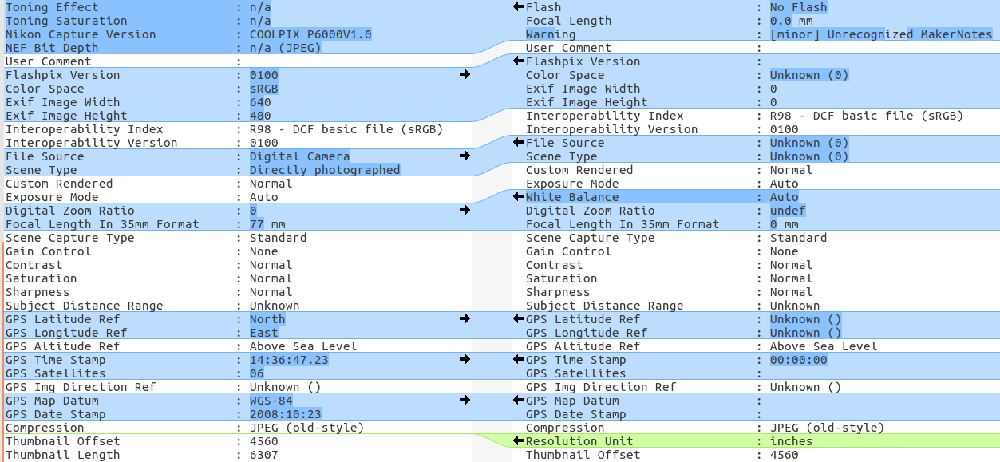

# ExiFREE
    Small EXIF data eraser.

    

## About
        Exchangeable Image File Format - EXIF, is a standard that specifies the formats for images,
    sound and ancillary tags used by digital cameras and smartphones.
        ExiFree is not a Exif library - it is a standalone C code written
    from scratch.

## Purpose
    To remove (erase) data stored in JPEG files that are part of the EXIF.
    Here are some examples of data that can be stored in image files, depending
    on the configuration of the camera/smartphone:
        - GPS location data;
        - device model and maker;
        - software details;
        - date and time at the moment the picture was taken and more.

## Building
    Update test submodule
        git submodule update --init --recursive .

    Build the binary
        make

    Build and run against the test images imported as git submodule from:
        https://github.com/ianare/exif-samples

        make test

    An error-free run will look like:

        $ make test
        rm -f exifree
        rm -rf exif-samples/jpg/gps/wiped_DSCN0010.jpg-bin
        /usr/bin/find exif-samples/jpg/ -name "wiped_*" -exec rm -f {} \;
        /usr/bin/gcc exifree.c fs.c buffer.c hexdump.c -Wall -Werror -o /home/user/exifree/exifree
        cd  exif-samples/jpg && ls *.jpg| while read x ; do /home/user/exifree/exifree -d . -f $x >/dev/null && md5=$(/usr/bin/md5sum wiped_$x |cut -d " " -f1) && match=$(grep $x  /home/user/exifree/test-useres.txt| cut -d " " -f1); if [ $md5 != $match ]; then echo ;	echo "!!!!!!!!!!!!! Fail user test for  exif-samples/jpg/$x :~("; echo; fi; done
        cd  exif-samples/jpg/tests && ls *.jpg| while read x ; do /home/user/exifree/exifree -d . -f $x >/dev/null && md5=$(/usr/bin/md5sum wiped_$x |cut -d " " -f1) && match=$(grep $x  /home/user/exifree/test-useres.txt| cut -d " " -f1); if [ $md5 != $match ]; then echo ;	echo "!!!!!!!!!!!!! Fail user test for  exif-samples/jpg/tests/$x :~("; echo; fi; done
        cd  exif-samples/jpg/mobile && ls *.jpg| while read x ; do /home/user/exifree/exifree -d . -f $x >/dev/null && md5=$(/usr/bin/md5sum wiped_$x |cut -d " " -f1) && match=$(grep $x  /home/user/exifree/test-useres.txt| cut -d " " -f1); if [ $md5 != $match ]; then echo ;	echo "!!!!!!!!!!!!! Fail user test for  exif-samples/jpg/mobile/$x :~("; echo; fi; done
        cd  exif-samples/jpg/gps && ls *.jpg| while read x ; do /home/user/exifree/exifree -d . -f $x >/dev/null && md5=$(/usr/bin/md5sum wiped_$x |cut -d " " -f1) && match=$(grep $x  /home/user/exifree/test-useres.txt| cut -d " " -f1); if [ $md5 != $match ]; then echo ;	echo "!!!!!!!!!!!!! Fail user test for  exif-samples/jpg/gps/$x :~("; echo; fi; done
        cd  exif-samples/jpg/hdr && ls *.jpg| while read x ; do /home/user/exifree/exifree -d . -f $x >/dev/null && md5=$(/usr/bin/md5sum wiped_$x |cut -d " " -f1) && match=$(grep $x  /home/user/exifree/test-useres.txt| cut -d " " -f1); if [ $md5 != $match ]; then echo ;	echo "!!!!!!!!!!!!! Fail user test for  exif-samples/jpg/hdr/$x :~("; echo; fi; done
        cd  exif-samples/jpg/gps && /home/user/exifree/exifree -f DSCN0010.jpg -s -d . >/dev/null && cd - && hexdump -C  exif-samples/jpg/gps/wiped_DSCN0010.jpg-bin/* >  exif-samples/jpg/gps/wiped_DSCN0010.jpg-bin/wiped_diff.diff && diff /home/user/exifree/md5-01-sct.txt  exif-samples/jpg/gps/wiped_DSCN0010.jpg-bin/wiped_diff.diff ; if [ $? != 0 ]; then echo ;	echo "!!!!!!!!!!!!! Fail hex test for  exif-samples/jpg/gps/wiped_DSCN0010.jpg-bin files :~("; echo; fi;
        /home/user/exifree

## Usage
    $ ./exifree -h
    Usage: exifree [OPTION]... <FILE>

    Optional arguments
     -f <jpeg file>
     -d <dirname>   output directory
     -v             verbose dump sections
     -r             dry-run
     -s             save exif sections in dirname
     -h             show this help

| Parameter                    | Description                           |
|:----------------------------:|---------------------------------------|
| `<image file>`               | Wipe out exif contents & save the output as `wiped_<image file>` |
| `-r`                         | Dry-run against image file - sanity test without generating an output |
| `-v`                         | Verbose show sections details to standard output |
| `-s`                         | Save sections in output `wiped_<image file>-bin` |
| `-d <destination directory>` | Save output file (and sections if used) in destination directory |
| `-h`                         | Show help and exit |

## Sample output

    Running with -v (long output, showing here begin-end only)

    Running with -s

    A glimpse of before and after

## References
    https://www.awaresystems.be/imaging/tiff/tifftags.html
    http://exif.org

## Bugs
    Currently working on find & name them but surely
    there are some or many.

## Improvements needed
    Support more image formats
    Support more image tags
    Implement fuzzer module
